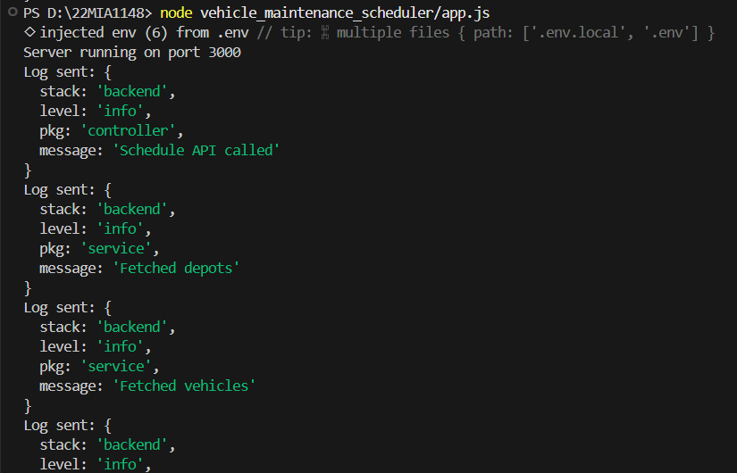
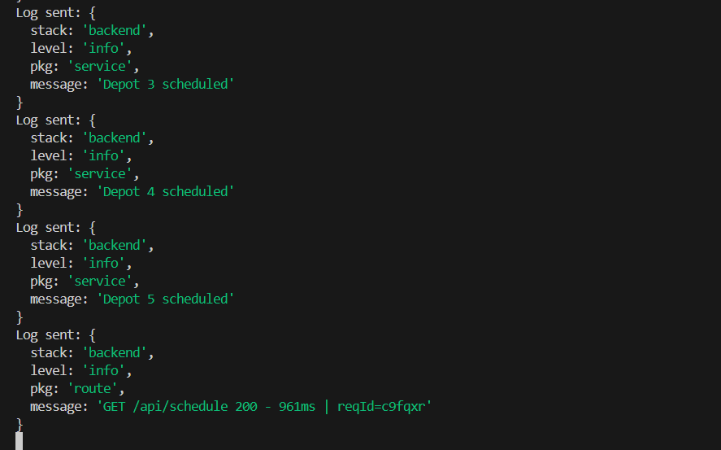
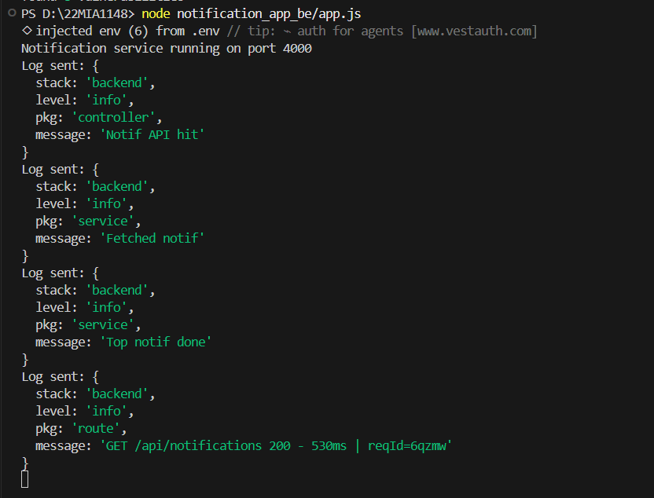
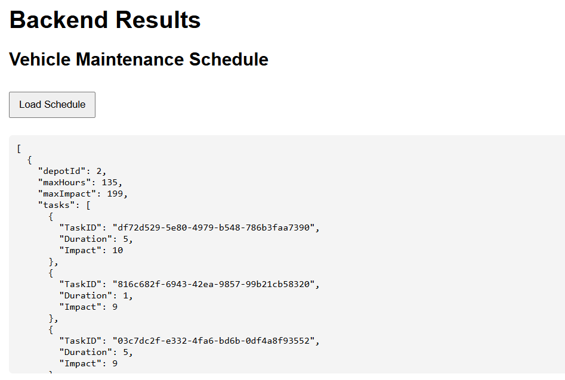
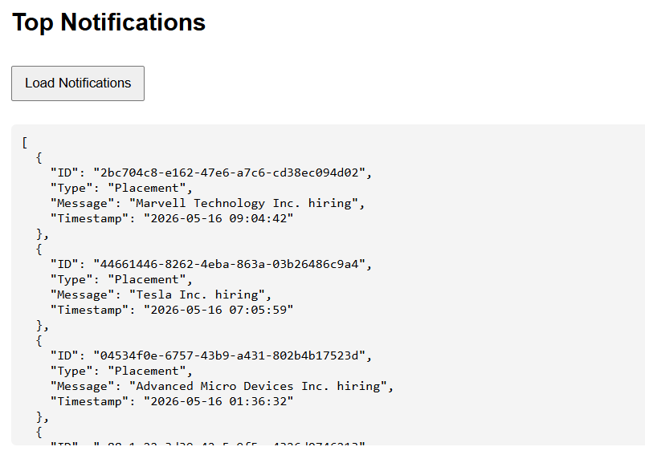

# 🚀 Backend Microservices System

This project implements a **Vehicle Maintenance Scheduler** and a **Campus Notification System** with a fully integrated **Logging Middleware**, built as part of the backend evaluation.

---

## 📌 Features

- ✅ Logging Middleware (centralized logging system)
- ✅ Vehicle Maintenance Scheduling (Knapsack optimization)
- ✅ Notification Priority System (Top 10 important alerts)
- ✅ API Integration with external test server
- ✅ Clean microservice architecture

---

## 📁 Project Structure

```
22MIA1148/
│
├── logging_middleware/
│   ├── auth.js
│   ├── config.js
│   ├── logger.js
│   ├── middleware.js
│   └── retry.js
│
├── vehicle_maintenance_scheduler/
│   ├── controllers/
│   │   └── schedulerController.js
│   ├── routes/
│   │   └── schedulerRoutes.js
│   ├── services/
│   │   ├── apiService.js
│   │   └── schedulerService.js
│   ├── utils/
│   │   └── knapsack.js
│   ├── app.js
│   └── routes.js
│
├── notification_app_be/
│   ├── controllers/
│   │   └── notificationController.js
│   ├── routes/
│   │   └── notificationRoutes.js
│   ├── services/
│   │   └── notificationService.js
│   └── app.js
│
├── frontend/
│   └── index.html
│
├── assets/
│   ├── A11.png
│   ├── A12.png
│   ├── A21.png
│   ├── B1.png
│   └── B2.png
│
├── .env
├── .gitignore
├── notification_system_design.md
├── package.json
└── README.md
```

---

## ⚙️ Setup Instructions

```bash
npm install
```

### Run Scheduler Service
```bash
node vehicle_maintenance_scheduler/app.js
```

### Run Notification Service
```bash
node notification_app_be/app.js
```

### Run Frontend
Open:
```
frontend/index.html
```

---

## 🧠 Logging Middleware

Centralized logging function:

```
Log(stack, level, package, message)
```

---

## 📸 Screenshots

### 🔹 Logging Middleware Output

<p align="center">
  
</p>

<p align="center">
  
</p>

<p align="center">
  
</p>

---

### 🔹 Vehicle Scheduler API Output

<p align="center">
  
</p>

---

### 🔹 Notification API Output

<p align="center">
  
</p>

---

## 📊 Vehicle Maintenance Output

```json
[ ... trimmed for brevity ... ]
```

---

## 🔔 Top Notifications Output

```json
[ ... trimmed for brevity ... ]
```

---

## ⚙️ Algorithms Used

- 0/1 Knapsack Algorithm
- Priority Sorting (Placement > Result > Event)

---

## ✅ Conclusion

Scalable backend system with logging, optimization, and API integration.
